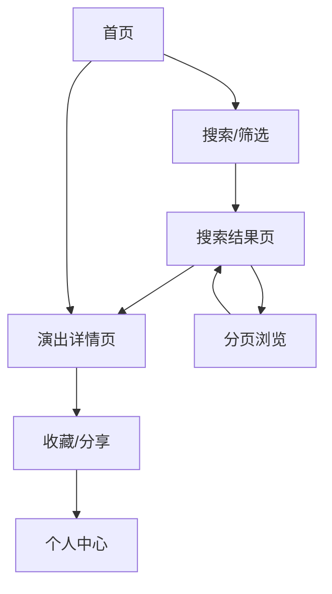

## 1. 产品概述
演出信息管理系统是一个集成大麦网和秀动平台演出数据的综合平台。系统通过API获取演出信息，提供统一的数据展示、筛选和管理功能，帮助用户快速找到感兴趣的演出活动。

主要目标：解决用户需要在多个平台搜索演出信息的问题，提供一站式的演出信息查询服务。适用于演出爱好者、票务代理、活动组织者等用户群体。

## 2. 核心功能

### 2.1 用户角色
| 角色 | 注册方式 | 核心权限 |
|------|----------|----------|
| 普通用户 | 邮箱注册/游客访问 | 浏览演出信息、使用筛选功能 |
| 管理员 | 后台创建 | 管理演出数据、查看系统日志、配置API参数 |

### 2.2 功能模块
系统包含以下核心页面：
1. **首页**：展示热门演出、搜索框、筛选器、演出列表
2. **演出详情页**：显示演出详细信息、艺人介绍、场地信息
3. **搜索结果页**：展示筛选后的演出列表、分页导航
4. **个人中心**：用户收藏、浏览历史、偏好设置

### 2.3 页面详情
| 页面名称 | 模块名称 | 功能描述 |
|----------|----------|----------|
| 首页 | 搜索模块 | 提供关键词搜索、热门搜索推荐 |
| 首页 | 筛选器模块 | 城市多选、演出类型多选、时间范围选择 |
| 首页 | 演出列表 | 卡片式展示演出信息、分页加载、图片懒加载 |
| 演出详情页 | 基本信息 | 展示演出名称、时间、地点、票价、购票链接 |
| 演出详情页 | 艺人信息 | 艺人简介、代表作品、相关演出 |
| 搜索结果页 | 筛选结果 | 显示符合条件的演出、支持结果排序 |
| 搜索结果页 | 分页导航 | 页码导航、每页数量选择 |
| 个人中心 | 收藏管理 | 查看收藏的演出、取消收藏 |
| 个人中心 | 浏览历史 | 查看最近浏览的演出记录 |

## 3. 核心流程

### 用户浏览流程
1. 用户访问首页，系统自动加载热门演出数据
2. 用户可通过搜索框输入关键词搜索演出
3. 用户可使用筛选器选择城市、演出类型、时间范围
4. 系统实时显示筛选结果，支持分页浏览
5. 用户点击演出卡片查看详细信息
6. 用户可收藏感兴趣的演出或分享演出信息

### 管理员流程
1. 管理员登录后台管理系统
2. 查看API调用状态和数据统计
3. 手动触发数据更新或配置定时任务
4. 查看系统日志和错误报告
5. 管理用户反馈和数据质量问题

## 4. 用户界面设计

### 4.1 设计风格
- **主色调**：深蓝色 (#1890ff) 作为品牌色，搭配白色背景
- **辅助色**：浅灰色 (#f5f5f5) 用于背景，深灰色 (#333) 用于文字
- **按钮样式**：圆角矩形，主要按钮使用渐变色
- **字体**：系统默认字体，标题16-18px，正文14px
- **布局风格**：卡片式布局，网格系统，响应式设计
- **图标风格**：使用简洁的线性图标，保持视觉一致性

### 4.2 页面设计概览
| 页面名称 | 模块名称 | UI元素 |
|----------|----------|----------|
| 首页 | 搜索模块 | 顶部搜索框，圆角设计，占位符文字，搜索按钮 |
| 首页 | 筛选器 | 下拉选择框，多选标签，日期选择器，重置按钮 |
| 首页 | 演出卡片 | 图片+标题+时间+地点+价格，悬停效果，收藏按钮 |
| 详情页 | 信息展示 | 大图轮播，信息分块展示，购票按钮突出显示 |
| 搜索结果 | 结果统计 | 显示筛选条件、结果数量、排序选项 |

### 4.3 响应式设计
- 桌面端优先设计，支持1200px以上宽屏显示
- 平板适配：768px-1199px，双列卡片布局
- 手机端适配：320px-767px，单列卡片布局
- 触摸优化：按钮大小适合手指点击，滑动操作支持