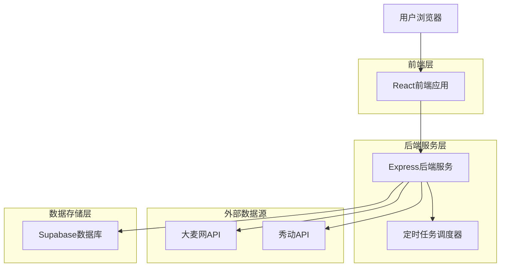
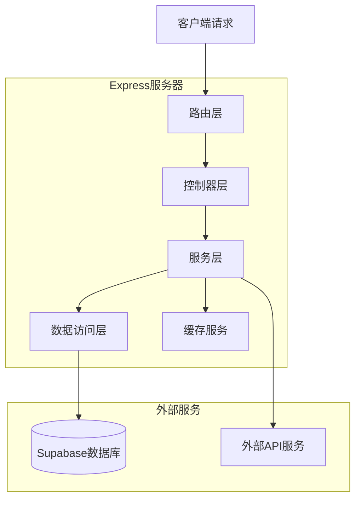
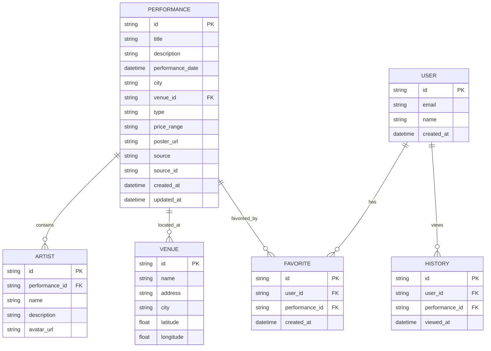

## 1. 架构设计



## 2. 技术描述

- **前端**: React@18 + TypeScript + TailwindCSS@3 + Vite
- **初始化工具**: vite-init
- **后端**: Express@4 + TypeScript + Node.js@18
- **数据库**: Supabase (PostgreSQL)
- **API客户端**: Axios@1.6
- **定时任务**: node-cron@3.0
- **日志系统**: Winston@3.11
- **测试框架**: Jest@29 + Supertest@6.3

## 3. 路由定义

| 路由 | 用途 |
|------|------|
| / | 首页，展示热门演出和筛选器 |
| /search | 搜索结果页，显示筛选后的演出列表 |
| /performance/:id | 演出详情页，展示单个演出详细信息 |
| /favorites | 个人收藏页面，管理用户收藏的演出 |
| /history | 浏览历史页面，显示用户浏览记录 |
| /api/performances | 获取演出列表API，支持分页和筛选 |
| /api/performance/:id | 获取单个演出详情API |
| /api/sync/data | 手动触发数据同步API |
| /api/favorites | 收藏管理API，增删改查用户收藏 |

## 4. API定义

### 4.1 演出数据API

```
GET /api/performances
```

请求参数：
| 参数名 | 参数类型 | 是否必需 | 描述 |
|--------|----------|----------|------|
| page | number | false | 页码，默认1 |
| limit | number | false | 每页数量，默认20 |
| cities | string[] | false | 城市筛选，多选 |
| types | string[] | false | 演出类型筛选，多选 |
| startDate | string | false | 开始日期 |
| endDate | string | false | 结束日期 |
| keyword | string | false | 关键词搜索 |

响应参数：
| 参数名 | 参数类型 | 描述 |
|--------|----------|------|
| data | Performance[] | 演出数据数组 |
| total | number | 总记录数 |
| page | number | 当前页码 |
| totalPages | number | 总页数 |

示例：
```json
{
  "data": [
    {
      "id": "perf_123456",
      "title": "周杰伦演唱会",
      "date": "2024-03-15",
      "time": "19:30",
      "city": "北京",
      "venue": "工人体育场",
      "type": "演唱会",
      "priceRange": "380-1680",
      "artists": ["周杰伦"],
      "poster": "https://example.com/poster.jpg",
      "source": "damai"
    }
  ],
  "total": 150,
  "page": 1,
  "totalPages": 8
}
```

### 4.2 数据同步API

```
POST /api/sync/data
```

请求参数：
| 参数名 | 参数类型 | 是否必需 | 描述 |
|--------|----------|----------|------|
| source | string | false | 数据源，damai/showstart/all |
| force | boolean | false | 是否强制更新 |

## 5. 服务器架构图



## 6. 数据模型

### 6.1 数据模型定义



### 6.2 数据定义语言

**演出表 (performances)**
```sql
-- 创建演出表
CREATE TABLE performances (
    id UUID PRIMARY KEY DEFAULT gen_random_uuid(),
    title VARCHAR(255) NOT NULL,
    description TEXT,
    performance_date TIMESTAMP WITH TIME ZONE NOT NULL,
    city VARCHAR(100) NOT NULL,
    venue_id UUID REFERENCES venues(id),
    type VARCHAR(50) NOT NULL,
    price_range VARCHAR(100),
    poster_url TEXT,
    source VARCHAR(50) NOT NULL,
    source_id VARCHAR(100) NOT NULL,
    ticket_url TEXT,
    status VARCHAR(20) DEFAULT 'active',
    created_at TIMESTAMP WITH TIME ZONE DEFAULT NOW(),
    updated_at TIMESTAMP WITH TIME ZONE DEFAULT NOW(),
    UNIQUE(source, source_id)
);

-- 创建索引
CREATE INDEX idx_performances_date ON performances(performance_date);
CREATE INDEX idx_performances_city ON performances(city);
CREATE INDEX idx_performances_type ON performances(type);
CREATE INDEX idx_performances_source ON performances(source);
CREATE INDEX idx_performances_status ON performances(status);
```

**艺人表 (artists)**
```sql
-- 创建艺人表
CREATE TABLE artists (
    id UUID PRIMARY KEY DEFAULT gen_random_uuid(),
    performance_id UUID REFERENCES performances(id) ON DELETE CASCADE,
    name VARCHAR(255) NOT NULL,
    description TEXT,
    avatar_url TEXT,
    created_at TIMESTAMP WITH TIME ZONE DEFAULT NOW()
);

-- 创建索引
CREATE INDEX idx_artists_performance_id ON artists(performance_id);
CREATE INDEX idx_artists_name ON artists(name);
```

**场地表 (venues)**
```sql
-- 创建场地表
CREATE TABLE venues (
    id UUID PRIMARY KEY DEFAULT gen_random_uuid(),
    name VARCHAR(255) NOT NULL,
    address TEXT,
    city VARCHAR(100) NOT NULL,
    latitude DECIMAL(10, 8),
    longitude DECIMAL(11, 8),
    created_at TIMESTAMP WITH TIME ZONE DEFAULT NOW(),
    UNIQUE(name, city)
);

-- 创建索引
CREATE INDEX idx_venues_city ON venues(city);
CREATE INDEX idx_venues_location ON venues(latitude, longitude);
```

**用户收藏表 (favorites)**
```sql
-- 创建收藏表
CREATE TABLE favorites (
    id UUID PRIMARY KEY DEFAULT gen_random_uuid(),
    user_id UUID NOT NULL,
    performance_id UUID REFERENCES performances(id) ON DELETE CASCADE,
    created_at TIMESTAMP WITH TIME ZONE DEFAULT NOW(),
    UNIQUE(user_id, performance_id)
);

-- 创建索引
CREATE INDEX idx_favorites_user_id ON favorites(user_id);
CREATE INDEX idx_favorites_performance_id ON favorites(performance_id);
CREATE INDEX idx_favorites_created_at ON favorites(created_at DESC);
```

**浏览历史表 (histories)**
```sql
-- 创建浏览历史表
CREATE TABLE histories (
    id UUID PRIMARY KEY DEFAULT gen_random_uuid(),
    user_id UUID NOT NULL,
    performance_id UUID REFERENCES performances(id) ON DELETE CASCADE,
    viewed_at TIMESTAMP WITH TIME ZONE DEFAULT NOW()
);

-- 创建索引
CREATE INDEX idx_histories_user_id ON histories(user_id);
CREATE INDEX idx_histories_performance_id ON histories(performance_id);
CREATE INDEX idx_histories_viewed_at ON histories(viewed_at DESC);
```

**Supabase权限设置**
```sql
-- 基本访问权限
GRANT SELECT ON performances TO anon;
GRANT SELECT ON performances TO authenticated;
GRANT SELECT ON artists TO anon;
GRANT SELECT ON artists TO authenticated;
GRANT SELECT ON venues TO anon;
GRANT SELECT ON venues TO authenticated;

-- 完整访问权限
GRANT ALL PRIVILEGES ON favorites TO authenticated;
GRANT ALL PRIVILEGES ON histories TO authenticated;

-- RLS策略（行级安全）
ALTER TABLE favorites ENABLE ROW LEVEL SECURITY;
ALTER TABLE histories ENABLE ROW LEVEL SECURITY;

-- 收藏表策略
CREATE POLICY "用户只能查看自己的收藏" ON favorites
    FOR SELECT USING (auth.uid() = user_id);

CREATE POLICY "用户只能管理自己的收藏" ON favorites
    FOR ALL USING (auth.uid() = user_id);

-- 历史记录策略
CREATE POLICY "用户只能查看自己的历史" ON histories
    FOR SELECT USING (auth.uid() = user_id);

CREATE POLICY "用户只能添加自己的历史" ON histories
    FOR INSERT WITH CHECK (auth.uid() = user