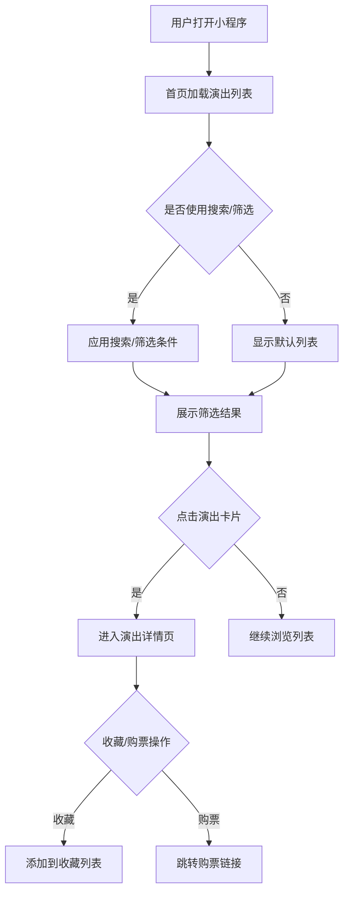

## 1. 产品概述
这是一个基于微信小程序的演出活动数据聚合平台，帮助用户发现和浏览各大平台的演出信息。通过云开发能力实现数据拉取、存储和展示，为用户提供便捷的演出信息查询服务。

解决用户需要在多个平台（大麦、秀动等）分别搜索演出信息的问题，集中展示所有演出数据，提供统一的筛选和浏览体验。

## 2. 核心功能

### 2.1 用户角色
| 角色 | 注册方式 | 核心权限 |
|------|----------|----------|
| 普通用户 | 微信授权登录 | 浏览演出信息、使用筛选功能、收藏演出 |
| 管理员 | 微信授权登录 + 后台配置 | 数据管理、系统配置、日志查看 |

### 2.2 功能模块
本小程序包含以下核心页面：
1. **首页**：演出列表展示、搜索栏、筛选器
2. **演出详情页**：演出详细信息、购票链接、收藏功能
3. **个人中心**：用户信息、收藏列表、设置
4. **搜索页**：高级搜索、历史记录
5. **筛选页**：多维度筛选条件设置

### 2.3 页面详情
| 页面名称 | 模块名称 | 功能描述 |
|----------|----------|----------|
| 首页 | 轮播图 | 展示热门推荐演出，支持自动轮播和手动切换 |
| 首页 | 搜索栏 | 支持关键词搜索，显示搜索历史和热门搜索 |
| 首页 | 筛选器 | 按类型、时间、地点等条件快速筛选 |
| 首页 | 演出列表 | 分页展示演出信息，支持下拉刷新和上拉加载 |
| 演出详情页 | 基本信息 | 展示演出名称、时间、地点、票价等核心信息 |
| 演出详情页 | 详情内容 | 图文介绍、艺人信息、注意事项等详细内容 |
| 演出详情页 | 购票入口 | 提供官方购票链接，支持多平台比价 |
| 演出详情页 | 收藏功能 | 一键收藏演出，同步到个人中心 |
| 个人中心 | 用户信息 | 显示微信头像、昵称，支持编辑个人资料 |
| 个人中心 | 收藏列表 | 展示收藏的演出，支持取消收藏 |
| 个人中心 | 设置 | 清除缓存、意见反馈、关于我们 |
| 搜索页 | 搜索输入 | 支持模糊搜索，实时显示搜索结果 |
| 搜索页 | 历史记录 | 显示最近搜索关键词，支持清空历史 |
| 搜索页 | 热门搜索 | 展示热门搜索标签，点击快速搜索 |
| 筛选页 | 类型筛选 | 按演出类型（演唱会、话剧、展览等）筛选 |
| 筛选页 | 时间筛选 | 按日期范围筛选，支持自定义时间段 |
| 筛选页 | 地点筛选 | 按城市、场馆筛选，支持多选 |
| 筛选页 | 价格筛选 | 按价格区间筛选，支持自定义价格范围 |

## 3. 核心流程

### 用户浏览流程
1. 用户打开小程序，进入首页
2. 浏览演出列表，可使用搜索或筛选功能
3. 点击感兴趣演出，进入详情页查看详细信息
4. 可收藏演出或点击购票链接跳转购票
5. 在个人中心查看收藏和管理个人信息

### 数据更新流程
1. 云函数定时任务定期从各大平台拉取演出数据
2. 对拉取的数据进行去重、清洗和标准化处理
3. 将处理后的数据存储到云数据库
4. 前端小程序从云数据库获取最新数据展示

## 4. 用户界面设计

### 4.1 设计风格
- **主色调**：活力橙 (#FF6B35) 配深灰色 (#2C3E50)
- **辅助色**：浅灰色 (#F5F5F5) 背景，白色卡片
- **按钮样式**：圆角矩形，主要操作用主色调，次要操作用边框样式
- **字体**：微信小程序默认字体，标题18px，正文14px，辅助文字12px
- **布局风格**：卡片式布局，上下分栏结构，顶部搜索栏固定
- **图标风格**：使用微信官方图标库，线性图标为主

### 4.2 页面设计概览
| 页面名称 | 模块名称 | UI元素 |
|----------|----------|--------|
| 首页 | 顶部搜索栏 | 白色背景，圆角搜索框，左侧扫码图标，右侧筛选按钮 |
| 首页 | 轮播图 | 全宽卡片，高度200rpx，圆角10rpx，自动轮播间隔3秒 |
| 首页 | 演出列表 | 卡片式布局，每张卡片包含演出海报、名称、时间、地点、价格 |
| 演出详情页 | 顶部图片 | 全宽演出海报，高度400rpx，支持手势缩放 |
| 演出详情页 | 基本信息 | 白色卡片，包含标题、时间、地点、价格等关键信息 |
| 演出详情页 | 详情内容 | 图文混排，支持富文本展示，分段显示 |
| 个人中心 | 用户信息 | 顶部背景图，圆形头像，用户昵称和ID |
| 个人中心 | 功能列表 | 图标+文字形式，分割线分隔，点击有反馈效果 |

### 4.3 响应式设计
- **适配原则**：以iPhone 6/7/8 (375x667) 为基准设计
- **响应式规则**：使用rpx单位，适配不同屏幕尺寸
- **交互优化**：考虑触摸操作，按钮最小尺寸88x88rpx
- **加载状态**：骨架屏加载，提升用户体验