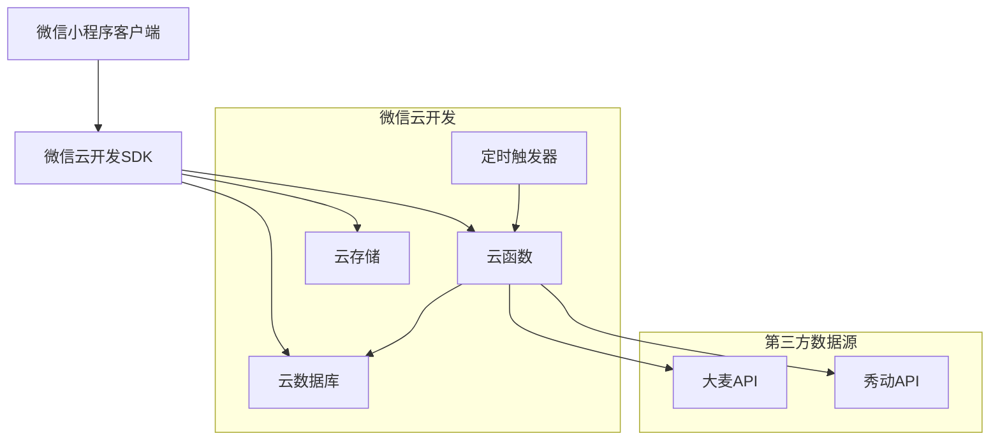
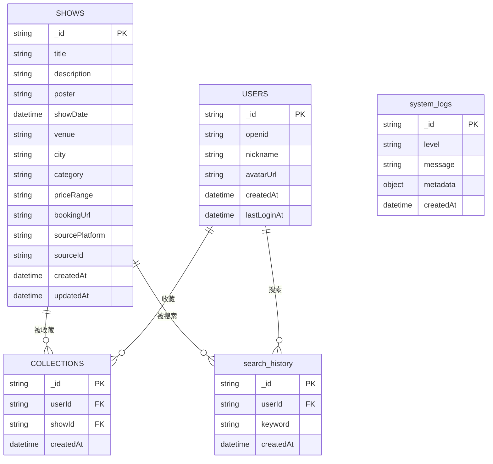

## 1. 架构设计



## 2. 技术描述

- **前端**: 微信小程序原生框架 + WXML + WXSS + JavaScript
- **初始化工具**: 微信开发者工具
- **后端**: 微信云开发（CloudBase）
- **数据库**: 云开发数据库（基于MongoDB）
- **存储**: 云开发云存储
- **函数计算**: 云开发云函数

## 3. 路由定义

| 页面路径 | 用途 |
|---------|------|
| /pages/index/index | 首页，展示演出列表和搜索功能 |
| /pages/detail/detail | 演出详情页，展示演出详细信息 |
| /pages/profile/profile | 个人中心，用户信息和收藏管理 |
| /pages/search/search | 搜索页面，支持关键词搜索 |
| /pages/filter/filter | 筛选页面，多维度条件筛选 |
| /pages/collection/collection | 收藏列表，展示用户收藏的演出 |

## 4. 云函数定义

### 4.1 数据同步函数
```javascript
// 函数名: syncShowData
// 触发方式: 定时触发器（每日0点、12点）
// 功能: 从第三方平台拉取演出数据

// 函数名: deduplicateData
// 触发方式: 数据同步完成后调用
// 功能: 对拉取的数据进行去重处理
```

### 4.2 API接口定义

#### 获取演出列表
```
GET /getShowList
```

请求参数:
| 参数名 | 类型 | 必填 | 说明 |
|--------|------|------|------|
| page | number | 否 | 页码，默认1 |
| pageSize | number | 否 | 每页数量，默认20 |
| keyword | string | 否 | 搜索关键词 |
| category | string | 否 | 演出类型 |
| city | string | 否 | 城市筛选 |
| dateRange | object | 否 | 日期范围 {start, end} |
| priceRange | object | 否 | 价格范围 {min, max} |

响应数据:
```json
{
  "code": 0,
  "message": "success",
  "data": {
    "list": [...],
    "total": 100,
    "page": 1,
    "pageSize": 20
  }
}
```

#### 获取演出详情
```
GET /getShowDetail
```

请求参数:
| 参数名 | 类型 | 必填 | 说明 |
|--------|------|------|------|
| id | string | 是 | 演出ID |

响应数据:
```json
{
  "code": 0,
  "message": "success",
  "data": {
    "id": "show_123",
    "title": "演唱会名称",
    "description": "演出描述",
    "poster": "海报URL",
    "date": "2024-01-01",
    "venue": "演出场馆",
    "city": "城市",
    "price": "票价信息",
    "bookingUrl": "购票链接"
  }
}
```

#### 收藏操作
```
POST /toggleCollection
```

请求参数:
| 参数名 | 类型 | 必填 | 说明 |
|--------|------|------|------|
| showId | string | 是 | 演出ID |
| action | string | 是 | 操作类型: collect/cancel |

## 5. 数据模型设计

### 5.1 数据库集合结构



### 5.2 数据库索引设计

```javascript
// 演出数据集合索引
db.collection('shows').createIndex({ title: 'text', description: 'text' })
db.collection('shows').createIndex({ showDate: 1 })
db.collection('shows').createIndex({ city: 1 })
db.collection('shows').createIndex({ category: 1 })
db.collection('shows').createIndex({ sourcePlatform: 1, sourceId: 1 }, { unique: true })

// 用户收藏集合索引
db.collection('collections').createIndex({ userId: 1, showId: 1 }, { unique: true })
db.collection('collections').createIndex({ userId: 1, createdAt: -1 })

// 搜索历史集合索引
db.collection('search_history').createIndex({ userId: 1, createdAt: -1 })

// 系统日志集合索引
db.collection('system_logs').createIndex({ level: 1, createdAt: -1 })
db.collection('system_logs').createIndex({ createdAt: -1 })
```

## 6. 安全与权限设计

### 6.1 数据库权限规则

```javascript
// 演出数据读取权限（公开可读）
{
  "read": true,
  "write": false
}

// 用户数据权限（仅本人可读写）
{
  "read": "doc._openid == auth.openid",
  "write": "doc._openid == auth.openid"
}

// 收藏数据权限（仅本人可读写）
{
  "read": "doc.userId == auth.openid",
  "write": "doc.userId == auth.openid"
}
```

### 6.2 云函数权限
- 数据同步函数：仅管理员可调用
- 用户相关函数：需要用户登录态
- 公共查询函数：允许匿名访问

## 7. 错误处理与日志

### 7.1 错误码定义
```javascript
const ERROR_CODES = {
  SUCCESS: 0,
  PARAM_ERROR: 400,
  AUTH_ERROR: 401,
  NOT_FOUND: 404,
  SERVER_ERROR: 500,
  THIRD_PARTY_ERROR: 503
}
```

### 7.2 日志记录规范
- 系统日志：记录云函数执行状态、API调用情况
- 错误日志：记录异常信息、堆栈跟踪
- 业务日志：记录用户行为、数据变更
- 性能日志：记录接口响应时间、数据库查询耗时

## 8. 性能优化策略

### 8.1 前端优化
- 图片懒加载和压缩
- 列表虚拟滚动
- 数据缓存策略
- 分包加载

### 8.2 后端优化
- 数据库查询优化
- 云函数冷启动优化
- 数据分页处理
- 缓存机制实现

### 8.3 网络优化
- 请求合并
- 数据压缩
- CDN加速
- 请求重试机制
